# SpiceDemo

This is a demo project for the Spice plugin for [Unreal Engine](https://www.unrealengine.com) available on [Fab](https://www.fab.com/listings/791cc505-26d8-4130-8df7-682b3c859f90). The plugin utilizes [ngspice](https://ngspice.sourceforge.io/) - the spice simulator for electric and electronic circuits.

## Table of contents

- [Demo project tutorial](#demo-project-tutorial)
- [Blueprints tutorial](#blueprints-tutorial)
- [License](#license)

## Demo project tutorial

[Video demonstration](https://youtu.be/XACr_H5ea24)

The demo project is made using Widget Blueprints.

The main widget is divided into 5 panels:
1. examples
2. netlist
3. alter
4. output
5. graph

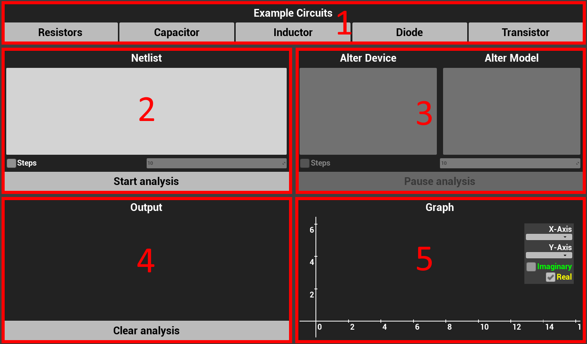

Click on any button from the example circuits to set the netlist or type the netlist in the netlist panel.

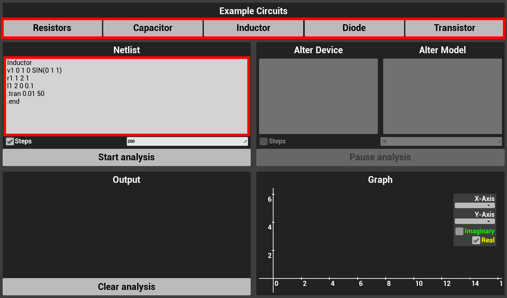

Leave the checkbox unchecked to run the analysis until finished or check the checkbox and enter a number to run only a fixed number of time-points and then pause.

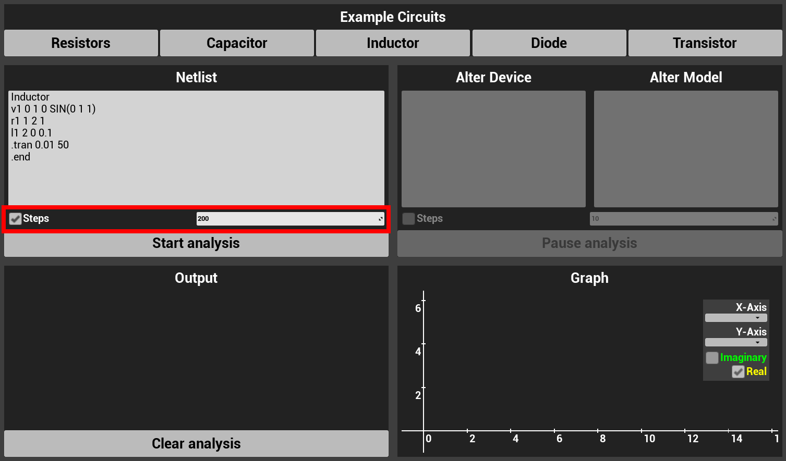

Start the analysis with the start button.

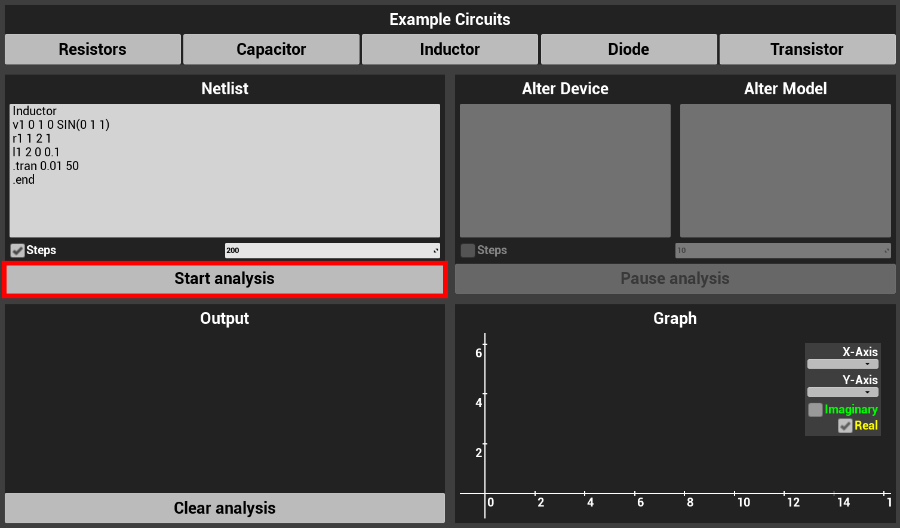

The output text from ngspice is set in the output panel and the graph is displayed in the graph panel.

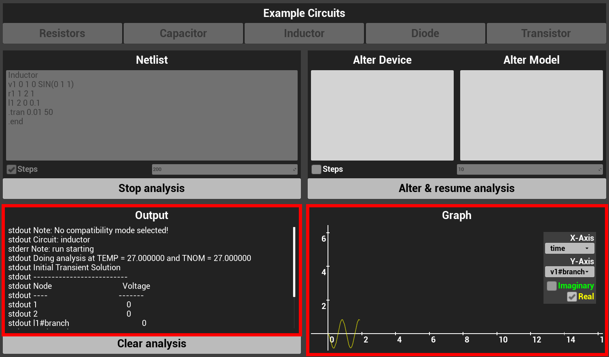

If the analysis is paused, type the instructions in the alter panel
to change the device or model parameters of the circuit.

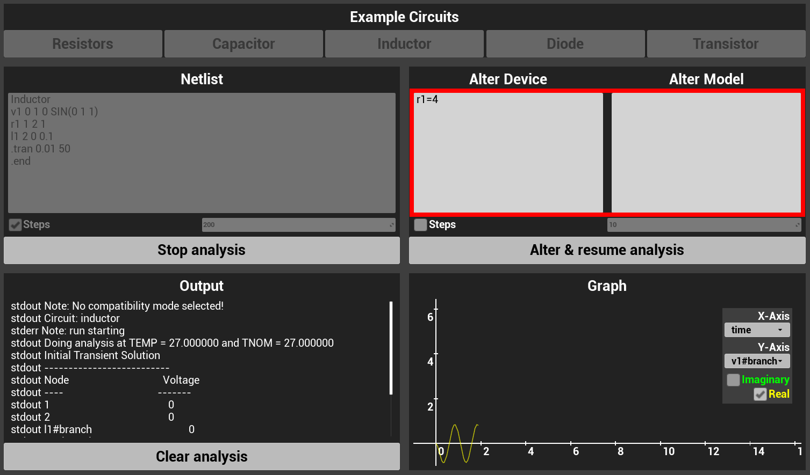

Leave the checkbox unchecked to run the analysis until finished or check the checkbox and enter a number to run only a fixed number of time-points and then pause again.

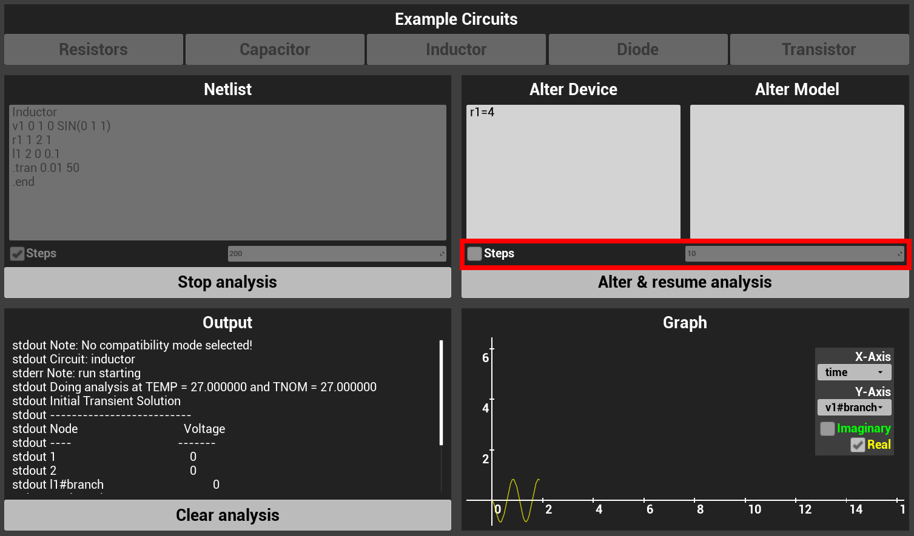

Click the resume button to apply the changes and continue the analysis.

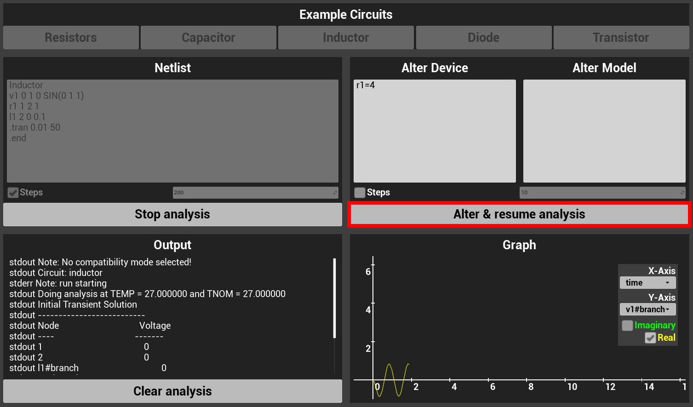

To control the graph panel, click and drag to move and scroll to zoom to the mouse position.
Hover over the graph to inspect specific values of the analysis.

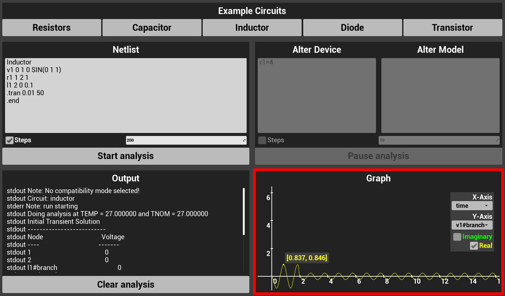

Use comboboxes to change the vectors for the X and Y axes and checkboxes to display the real and imaginary values.

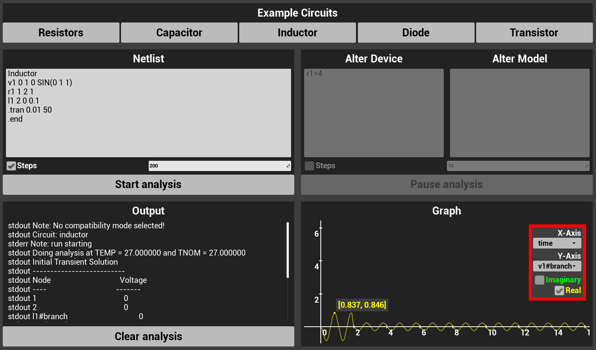

The clear button clears the analysis data.

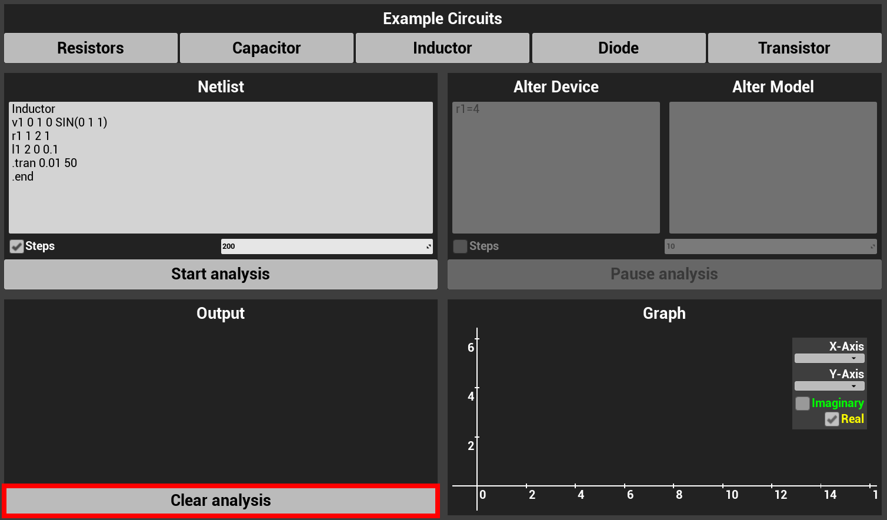

## Blueprints tutorial

To communicate with ngspice, construct an `NgspiceCircuit`.

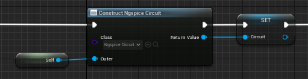

To start an analysis, use the `StartAnalysis` function and provide a netlist.
The analysis starts in the background thread of ngspice.
StepCount can be set to run only a fixed number of time-points and then pause or set (StepCount <= 0) to run until finish.
The StepCount can be retrieved using the `GetStepCount` function.

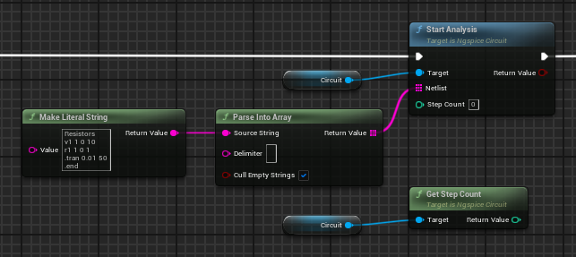

To request a pause or resume of an analysis, use the `SetAnalysisShouldPause` function.
The analysis does not pause immediately, because the background thread takes some time to stop.

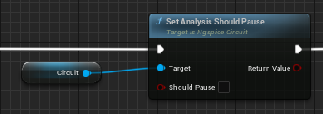

The state of the pause request is indicated by the `ShouldPause` function.

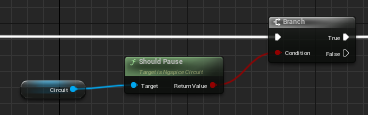

To stop an analysis, use the `StopAnalysis` function.

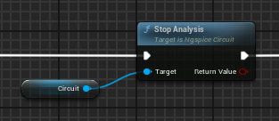

The `IsAnalysing` function indicates the analysis of the circuit is in progress.

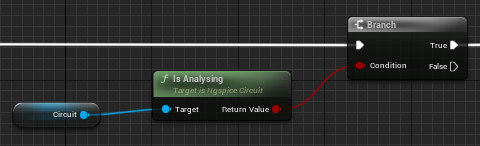

Ngspice can solve only one circuit at a time.
If multiple analyses are started simultaneously, they are scheduled to run one by one.
Beware of paused analyses, the analysis of the next circuit cannot start while the previous one is paused.

`AnalysisStartedDelegate` fires when the background thread starts.
`AnalysisPausedDelegate` fires when the background thread pauses.
`AnalysisFinishedDelegate` fires when the background thread finishes.

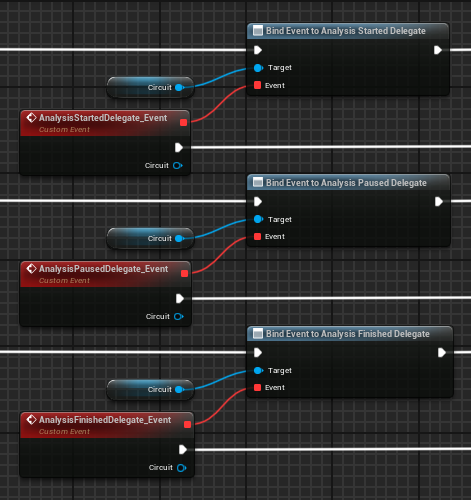

The state of the background thread visible from the Game Thread can be obtained using the `IsRunning` function.
There is no event to be fired when new data is calculated by ngspice, because it would fire too many times per tick and slow down the Game Thread.
To get data during the analysis up to that point, the `Tick` event together with the `IsRunning` function should be used.

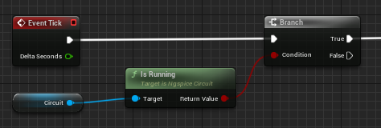

To update an analysis, use the `UpdateAnalysisWithStepCount`, `UpdateAnalysisWithAlter` or `UpdateAnalysisWithAltermod` function.
The changes will be processed when the analysis starts or resumes.
To apply the changes if the analysis is running, restart it by pausing it with the `SetAnalysisShouldPause` function and resuming it with the `SetAnalysisShouldPause` function after the `AnalysisPausedDelegate` is called.

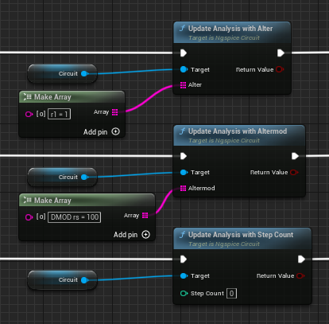

Output from ngspice consists of StdOutput (an array of Strings) and AnalysisValues (a map of Names as keys and Vector2D arrays as values).
StdOutput can be retrieved using the `GetStdOutput` function.
Keys to the map of AnalysisValues can be retrieved using the `GetAnalysisValueKeys` function.
Each key is an input to the `GetAnalysisValues` function to get the array of values for the particular vector.
Values are Vector2Ds to represent the real and imaginary parts.

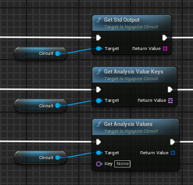

Output from ngspice can be removed or cleared using the `ClearStdOutput`, `RemoveRangeStdOutput`, `ClearAnalysisValues` or `RemoveRangeAnalysisValues` function.
All outputs are also cleared at the start of the analysis.

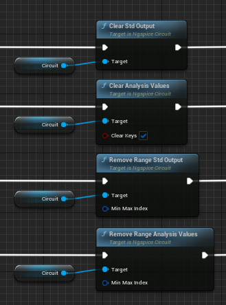

Additional C++ functions are exposed for Blueprints to allow more performant manipulation with arrays and to simplify data for displaying on graphs.

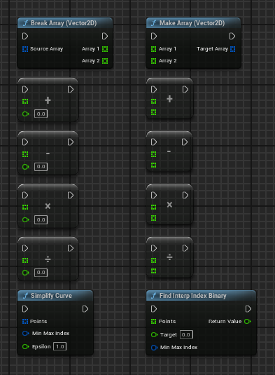

## License

Ngspice is open source under the [3-clause BSD license](https://sourceforge.net/p/ngspice/ngspice/ci/master/tree/COPYING).
